# haochilao-app
移动端扫码点餐App，使用vue-cli3开发的WebApp。使用了Vue.js、vue-router、vuex、vant，使用了基于better-scroll的框架cube-ui的scroll组件。   
最近开发项目练手，不属于公司项目，纯属自己集设计，开发，测试于一身，可能看起来并不是很美观，因为也缺乏设计的经验和素材。目前app端主要页面基本完工（还差几个页面等待有时间再续）。   
## 选择主题风格
* 设计一个app，需要有自己的主题风格，通过界面来凸显主题，设计思路也要跟主题相搭配，例如：卡通主题，……   
## 选择主题颜色
* 这个很重要，因为针对的是餐饮，颜色必须要让人有食欲，不能使用刺眼等使人反感，焦虑的颜色   
* 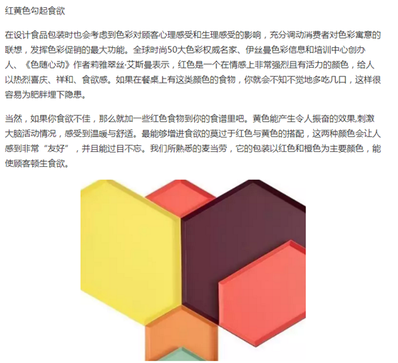
* 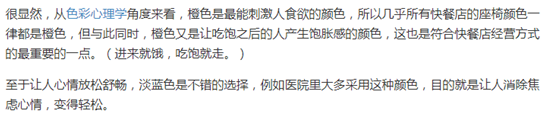
* 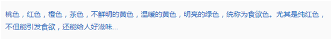
##  说明   
* 此版本为第一版，暂不做外卖系统。等下个版本再更新。
* 页面图片全部来源于网络，使用了tinypng进行图片压缩。但是未修改尺寸，所使用的的图片均是大图，所以占用宽带较大，虽然使用了懒加载，加载还是会有点慢。   
* 图标使用的是阿里图标库的多色图标（单色感觉太单调了）。
## 主要页面
### 欢迎登录页   
  * 用户使用微信扫描桌台上的二维码进入欢迎页面。  
  * <figure class="third">
      
    </figure>     
  * 登录要做H5页面的微信授权登录，然后需要携带一个桌台号的参数。欢迎页包括店家店名，logo，欢迎语，开始点餐按钮。logo目前没有合适素材，有待完善。
### 选择用餐人数页   
  * 用户点击开始点餐进入选择用餐人数页面。   
  * <figure class="third">
      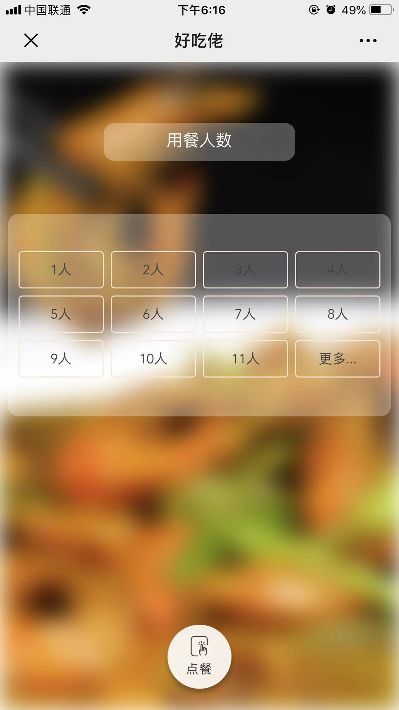 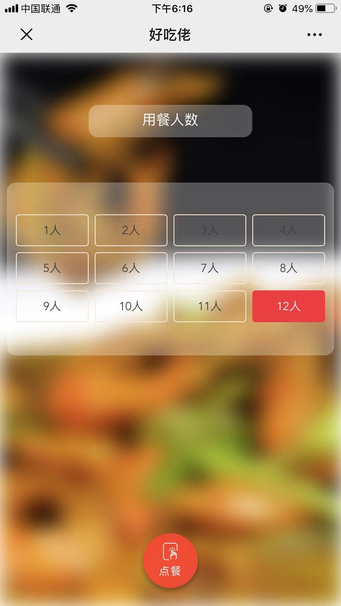
    </figure>     
  * 列表给出了11个人数选框，如果有超过的，点击更多即可弹出计数器弹框，可以自定义人数（计数器下限12，无上限）。选择完人数后，点餐按钮颜色改变（开始为禁用状态），可以进入点餐页。
### 点餐页    
  * <figure class="third">
      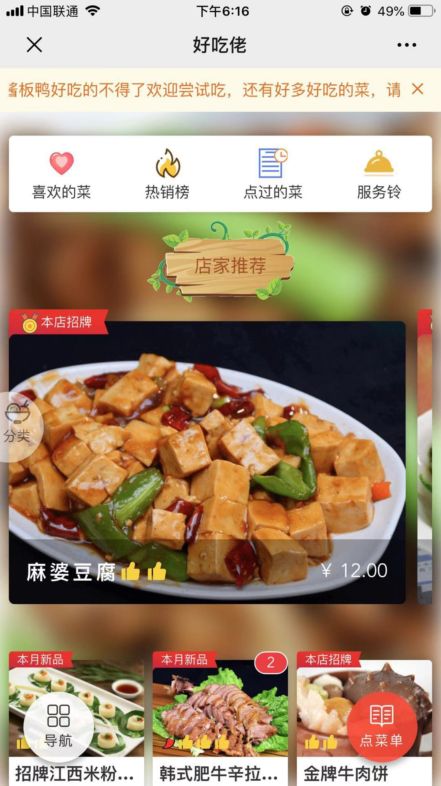 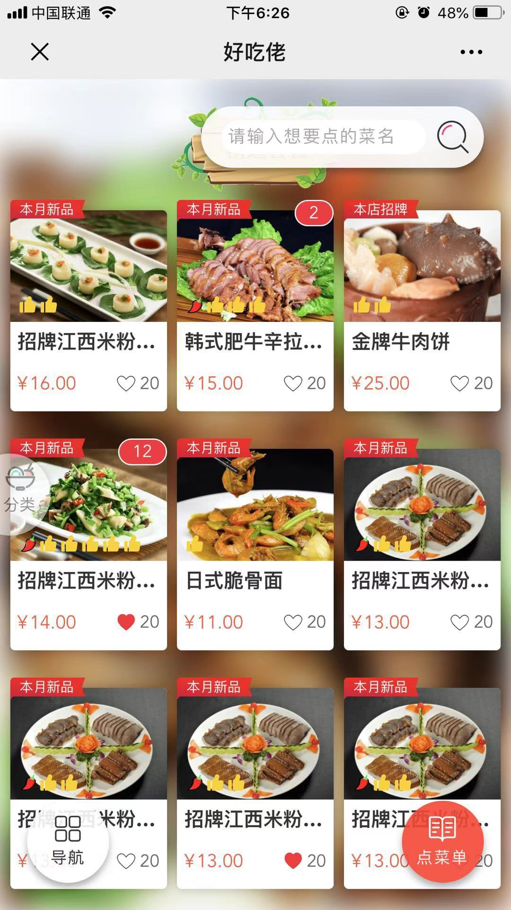 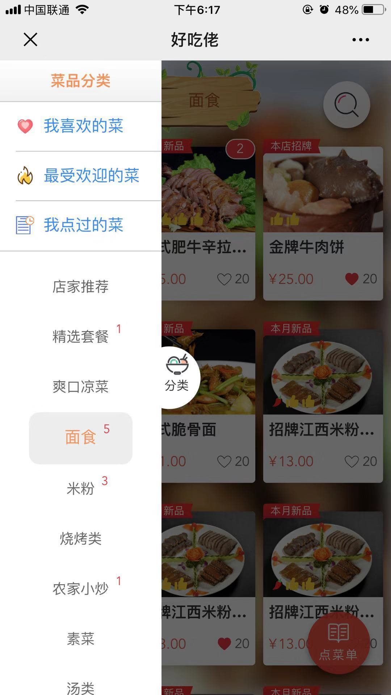 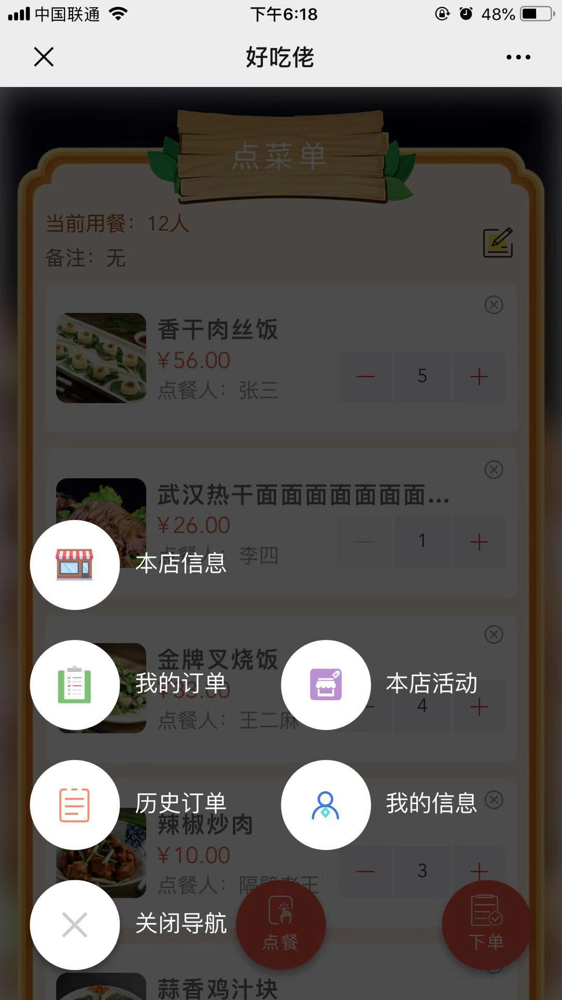
    </figure>    
  * 顶部是一个滚动公告栏，用于介绍一些店内特色或者活动，可以点击x关掉它。   
  * 上部功能栏分为喜欢的菜、热销榜、点过的菜以及服务铃。功能既所述，前面三个是共用列表组件的，最后一个服务铃，还未完善，暂定使用websoket。   
  * 往下是一个横向轮播，使用的scroll组件（整个页面也是使用了scroll，后面封装了page组件，把scroll和背景图切换封装在了一起）。   
  * 菜品列表三列使用flex布局。列表显示菜品图片、促销标签、菜品名称、菜品价格、喜欢人数、本人是否喜欢、已订购数量、是否辣、推荐度（好评度）。图片使用了懒加载，把列表封装成了组件。
  * 往下滑动页面，渐现搜索按钮，点击伸出搜索框。可以另外做搜索页，使用localStorage保存搜索历史。
  * 侧边分类栏，默认半透明贴边，点击弹开不透明显示分类。分类上部分也是页面上部分那三个选项，为了方便用户不用滑到页面顶部才进行筛选。分类栏里显示各个类别，如果有订购显示订购总数。点击类别页面滚动到指定类别位置。    
  * 底部导航按钮，点击弹出导航栏列表，包含，本店信息、我的订单、历史订单、本店活动、我的信息，暂时想到这几个。
### 菜品详情页    
  * 点击菜品列表菜品进入菜品详情页。
  * <figure class="third">
      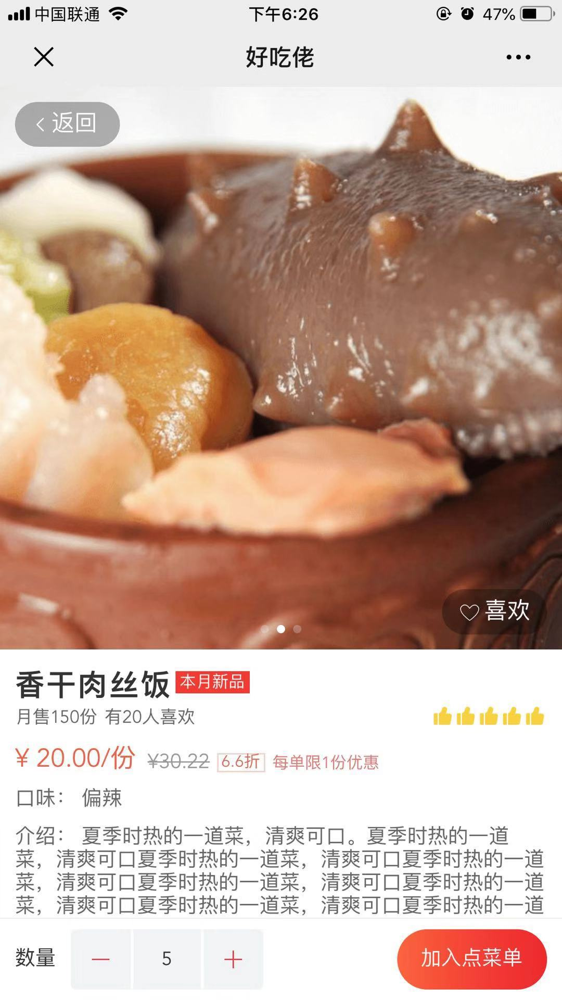
    </figure>
  * 顶部使用轮播介绍菜品主图。
  * 有喜欢按钮，可以添加收藏。
  * 包含菜品的所有信息，包括名称，促销标签，推荐度等等。
  * 选择下单数量，加入点菜单按钮。
### 点菜单页（购物车）    
  * 点击点菜单按钮跳到菜单页。   
  * <figure class="third">
      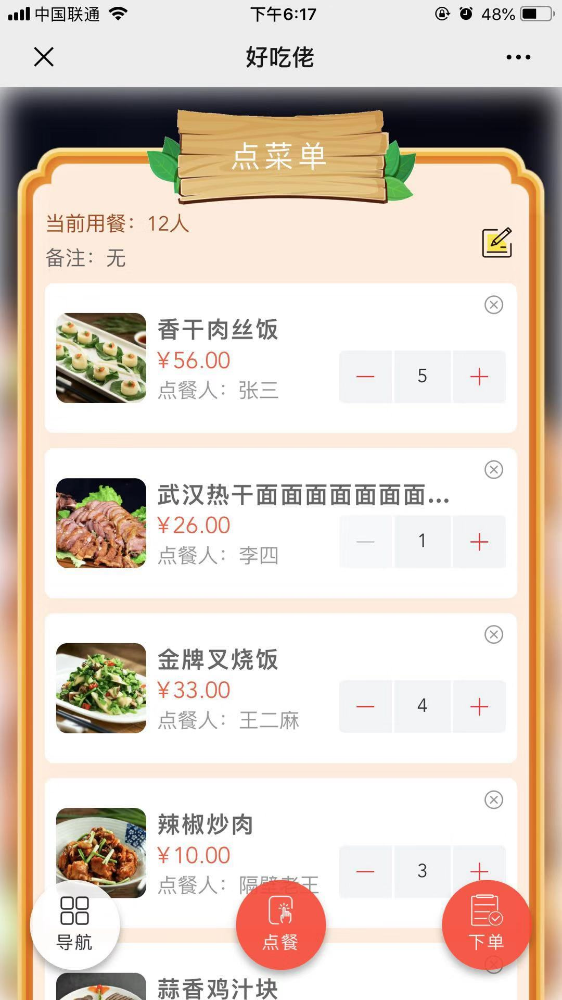 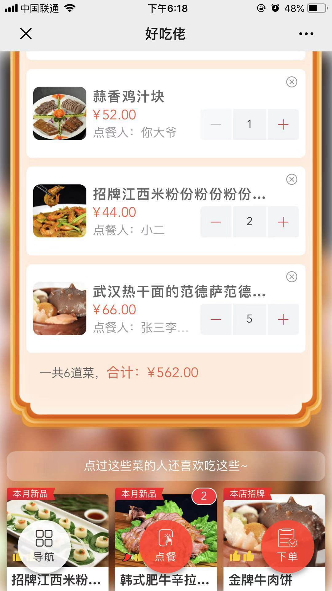 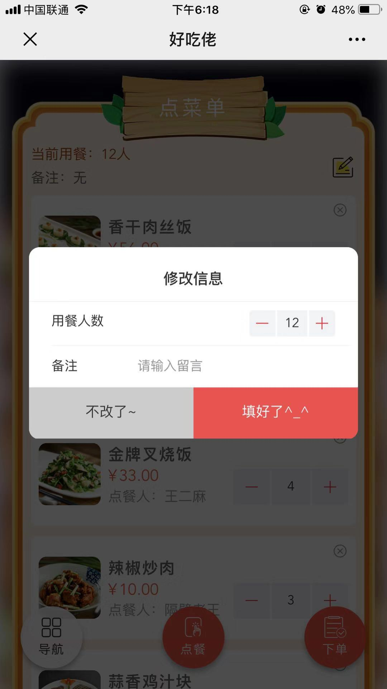 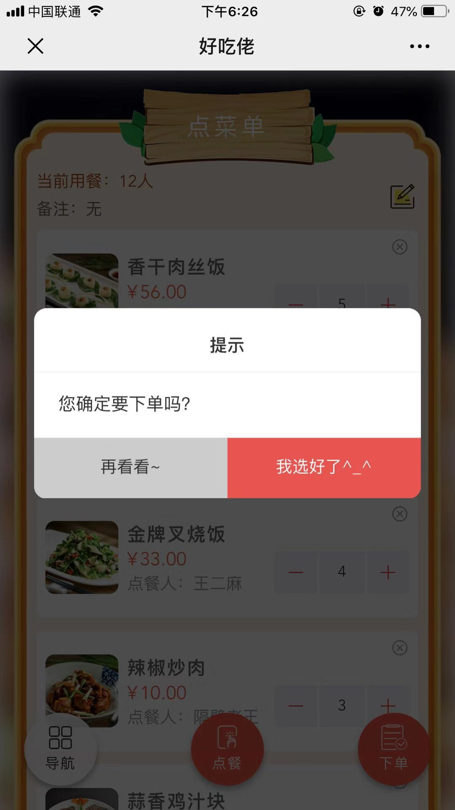
    </figure>
  * 当前用餐人数。
  * 客户备注。
  * 要下单的菜品列表。
  * 合计金额。
  * 相关推荐。
### 我的订单页（订单列表）   
  * 从导航列表进入我的订单。    
  * <figure class="third">
      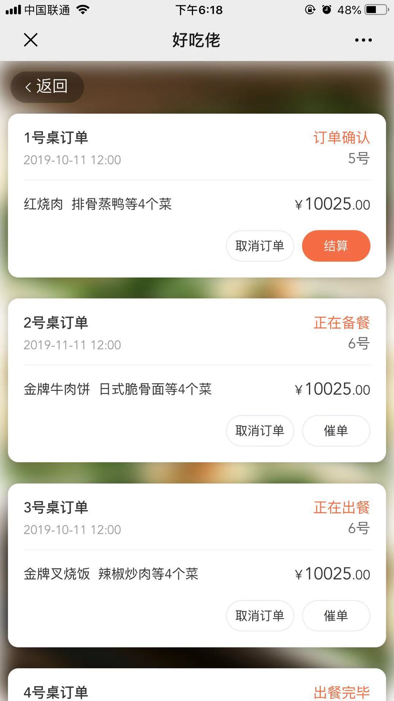 
    </figure>
  * 显示几号桌（外卖显示外送）订单，订单状态，下单时间，排队单号（让顾客有个心理预期，大概知道要等多久），显示两个菜名（多余省略），显示订单实付价格，还有功能按钮。   
  订单状态：1 订单确认 => 2 正在备餐 => 3 正在出餐  => 4 出餐完毕 => （5 正在送餐=>）6 已完成 => 7 已取消    
  * 功能：   
    1. 删除订单：删除已完结的历史订单（6，7）
    2. 取消订单：取消当前已下单的订单（1，2）
    3. 再来一单：复制订单信息到点菜单（6，7）
    4. 催单：通知厨房加快速度（1，2，3）
    5. 结算：线上付款（1 - 5）
### 订单详情页
  * 点击订单列表，进入详情。   
  * <figure class="third">
      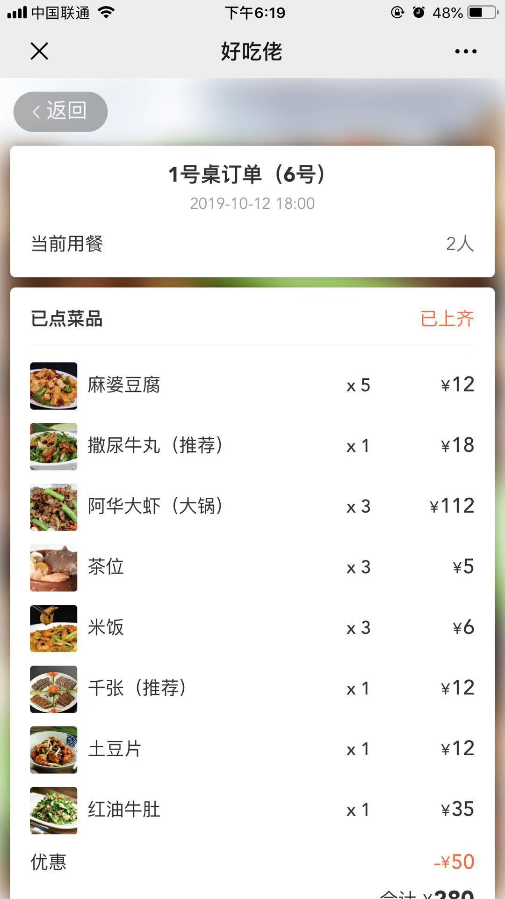 
    </figure>
  * 显示详情桌号，排队单号，下单时间，用餐人数，所有已点菜品信息，订单状态，订单编号和功能。    
  * 菜品信息列表包括，每个菜品的主图，名称，数量，单价。最后优惠减免，合计后实付总价。   
### 持续更新...

